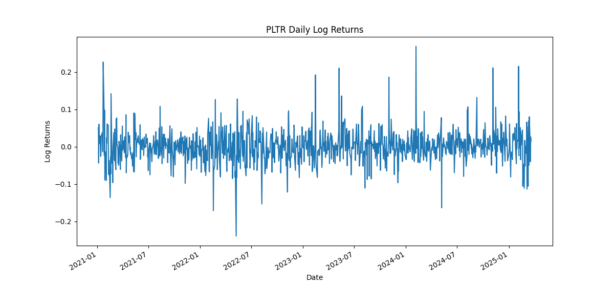
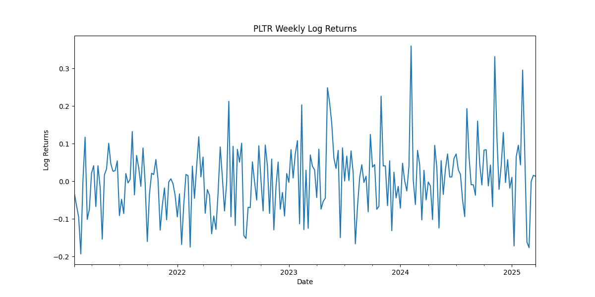
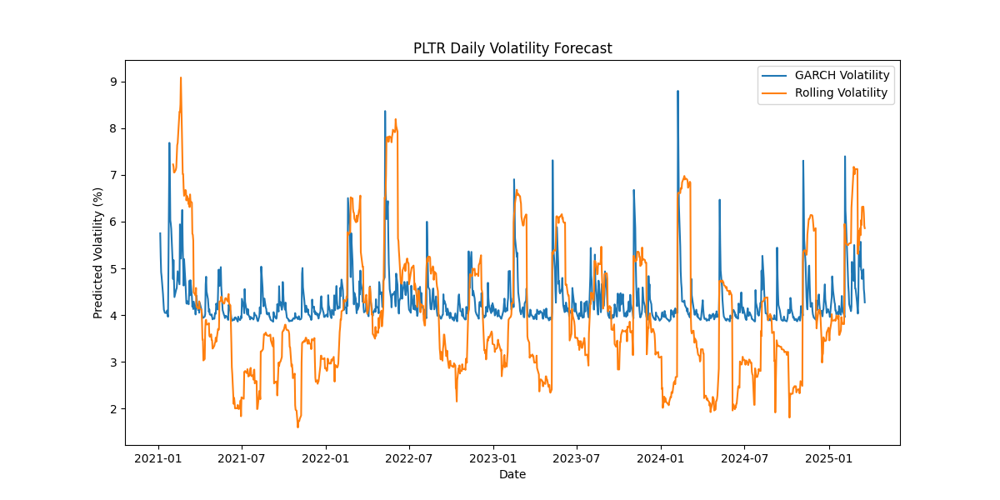
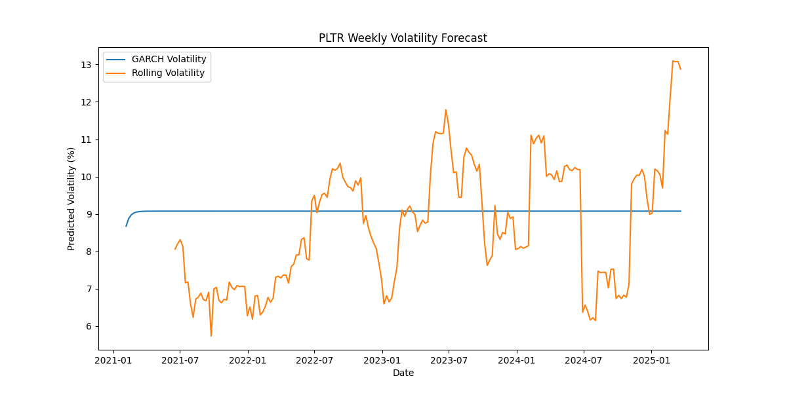
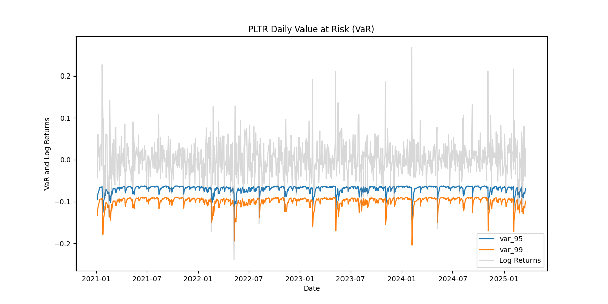
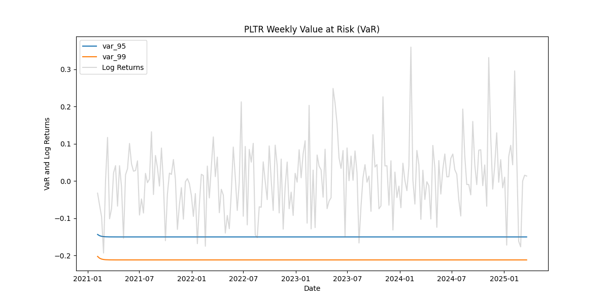

# Capstone Project Proposal: Risk Modelling and Volatility Clustering for Securities  
## A Review of Palantir Technologies Inc. (PLTR) Stock Volatility via the Yahoo Finance API

**Course**: Udacity; Data Science Nanodegree
**Author**: Niall MacKenzie

---

## Project Overview  
This project aimed to model and forecast the volatility of PLTR stock using historical data from the Yahoo Finance API. By applying advanced statistical techniques, this seeks to understand how volatility behaves over time—specifically, how periods of intense price swings tend to cluster—and to provide forecasts that can inform risk management strategies such as pricing options and designing hedging strategies.

---

## Medium Article
There is also a Medium.com Article associated with this repository (I wrote it before I realised I was to be more in-depth as like in here!)

You can [view it here!](https://medium.com/@theniallmackenzie/forecasting-stock-volatility-a-glimpse-into-pltrs-future-with-machine-learning-be4f0e636e03)

---

## Problem Statement  
The core question was: Can we effectively model and forecast the volatility of PLTR stock for the period 1 January 2021 to 21 March 2025 using machine learning techniques? Our objectives were to:  
- Quantify recent volatility  
- Identify clusters of volatility  
- Forecast future volatility levels  
- Estimate risk levels using measures such as Value at Risk (VaR)

---

## Metrics and Evaluation  
The performance of our forecasting model was evaluated by comparing the forecasted volatility with realised market behaviour through backtesting. Also applied is statistical criteria like the Akaike Information Criterion (AIC) and Bayesian Information Criterion (BIC) to assess model fit. Additionally, error metrics such as Mean Squared Error (MSE) and Mean Absolute Error (MAE) were considered to quantify forecasting accuracy.

---

## Data Exploration and Preprocessing  
Historical PLTR stock data—including daily open, high, low, close, adjusted close prices, and trading volume—was retrieved via the Yahoo Finance API. During pre-processing we calculate derived features such as log returns and rolling standard deviations to capture the dynamics of stock price changes. Exploratory analysis involved visualising these features to identify trends, clusters, and any anomalies in the data.

---

## Visualisation Details  
The study generated several visual outputs to summarise the findings:

- **Returns Plots:**  
  These graphs display day-to-day and week-to-week price changes, highlighting periods of high and low volatility.  
    
  

- **Volatility Forecast Plots:**  
  These charts compare the volatility forecast from our advanced GARCH model with a simple rolling standard deviation. The x-axis represents time, and the y-axis represents the level of predicted volatility.  
    
  

- **Risk Evaluation Charts:**  
  These visuals overlay the model’s risk thresholds (VaR estimates) on actual return data to demonstrate the accuracy of our risk predictions.  
    
  

---

## Algorithms and Techniques Used  
The core technique applied was the GARCH(1,1) model, which is well-regarded for capturing volatility clustering. The model is represented by the equation:

\[
\sigma_t^2 = \omega + \alpha \epsilon_{t-1}^2 + \beta \sigma_{t-1}^2
\]

where:  
- \(\sigma_t^2\) is the conditional variance at time \(t\),  
- \(\omega\) is the constant term,  
- \(\alpha\) quantifies the impact of previous shocks (\(\epsilon_{t-1}^2\)), and  
- \(\beta\) represents the persistence of previous volatility (\(\sigma_{t-1}^2\)).  

This model was chosen for its simplicity, robustness, and widespread acceptance as a benchmark for volatility forecasting. For comparison, we use a simple rolling standard deviation as a baseline.

---

## Accuracy and Validation  
The accuracy of the GARCH(1,1) model was validated through backtesting. Our daily model demonstrated strong performance, with the observed risk thresholds closely matching the predicted levels. Similarly, the weekly model, while naturally smoother due to data aggregation, effectively captured the longer-term volatility trends. The evaluation metrics (AIC, BIC, MSE, and MAE) confirmed that the model provided reliable forecasts that align well with historical data.

Backtesting shows: 

**Backtest Results:**  

- **Daily Model:**

  - *VaR 95%:* Observed exceedance rate of ~3.5% vs. expected 5% (PASS).  

  - *VaR 99%:* Observed exceedance rate of ~1.14% vs. expected 1% (PASS).

- **Weekly Model:**   

  - *VaR 95%:* Observed exceedance rate of ~5% (PASS).  

  - *VaR 99%:* Observed exceedance rate is near 0% (PASS).

---

## Methodology  
The project was executed in the following phases:
1. **Data Collection:** Historical PLTR data was downloaded via the Yahoo Finance API.
2. **Data Cleaning and Preprocessing:** Missing values were addressed and derived features (log returns, rolling standard deviations) were computed.
3. **Exploratory Data Analysis:** Trends and clusters in return and volatility patterns were identified through visual analysis.
4. **Modelling:** The GARCH(1,1) model was implemented to forecast volatility.
5. **Validation:** Model forecasts were validated via backtesting and statistical evaluation.
6. **Visualisation and Reporting:** Findings were summarised using comprehensive visual outputs and a detailed report.

---

## Suggestions for Future Improvements  
Future work may explore more complex variants of the GARCH model, such as GARCH(1,2) or EGARCH, to capture additional nuances in volatility behaviour. Incorporating macroeconomic indicators—such as inflation, interest rates, or the VIX index—could further enhance forecasting accuracy. Additionally, expanding the evaluation to include out-of-sample testing and cross-validation techniques would improve model robustness and predictive power. Equally, this model only gives volatility, it does not give DIRECTION of volatility. Including this would massively improve the potential of this project. 

---
---

## Sources  
- **LearnSignal Blog on GARCH Models:** [https://www.learnsignal.com/blog/garch-model/](https://www.learnsignal.com/blog/garch-model/)  
- **LSE Q. Yao Paper:** [https://stats.lse.ac.uk/q.yao/qyao.links/paper/ej08.pdf](https://stats.lse.ac.uk/q.yao/qyao.links/paper/ej08.pdf) Huang, D., Wang, H. & Yao, Q. (2008). Econometrics Journal, 11, 27–38.  